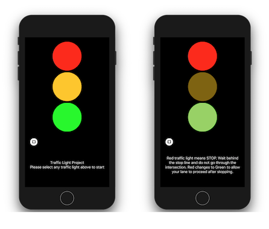

# TrafficLightProject
This is a simple app that shows how a traffic light sequence work to a person who has no knowledge of traffic lights nor the different colors that comes with it.

# License
See the [LICENSE](https://github.com/arvnq/TrafficLightProject/blob/master/LICENSE) file for more info.
